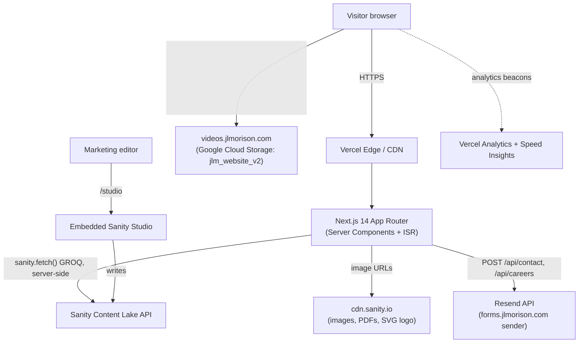

# 01 · Architecture

How the system is put together: the pieces, how a request flows through them, and why the main technical choices were made.

`Last updated: 2026-07-30`
`Maintainer:` TODO(verify)

---

## System diagram



## Rendering strategy per route

Every content page follows the same shape: a **Server Component `page.tsx`** runs `generateMetadata()` and fetches Sanity, then renders a **`'use client'` companion** (`*Client.tsx`) that holds the interactive/animated UI. All content pages use **ISR with `export const revalidate = 60`** — pages are statically cached on Vercel's edge and regenerated at most once every 60 seconds, so Sanity edits appear within about a minute without a redeploy.

| Route | Strategy | Notes |
|---|---|---|
| `/` | ISR 60s | Homepage; composed from server components, no client wrapper file |
| `/morisons-baby-dreams` | ISR 60s | → `MorisonsBabyDreamsClient` |
| `/bigen` | ISR 60s | → `BigenClient` |
| `/emoform` | ISR 60s | → `EmoformClient` (+ 3 sub-components); **Lenis smooth-scroll disabled** here |
| `/morisons` | ISR 60s | House-brand poster page → `MorisonsClient` |
| `/our-story` | ISR 60s | → `OurStoryClient` |
| `/leadership-team` | ISR 60s | Grid → `LeadershipGrid` |
| `/leadership-team/[slug]` | ISR 60s + `generateStaticParams` | Per-leader profile, pre-rendered from Sanity slugs |
| `/life-at-jlm` | ISR 60s | → `LifeAtJlmClient` |
| `/philanthropy` | ISR 60s | → `PhilanthropyClient` |
| `/esg` | ISR 60s | → `EsgClient` |
| `/careers` | ISR 60s | → `CareersClient`; posts to `/api/careers` |
| `/contact-us` | ISR 60s | → `ContactClient`; posts to `/api/contact` |
| `/investor-relations` | ISR 60s | → `InvestorRelationsClient` (Sanity-driven tables) |
| `/blog` | ISR 60s | Index → `blog/BlogIndex` |
| `/blog/[slug]` | ISR 60s + `generateStaticParams` | Article, Portable Text body |
| `/studio/[[...tool]]` | `dynamic = 'force-static'` | Embedded Sanity Studio (client-only) |
| `/api/contact` | `runtime = 'nodejs'`, POST | Resend email |
| `/api/careers` | `runtime = 'nodejs'`, POST | Resend email + resume attachment |
| `/sitemap.xml` (`sitemap.ts`) | ISR 3600s | Static routes + live blog/leader slugs |
| `/robots.txt` (`robots.ts`) | static | Disallows `/studio` and `/api` |

The **root layout** (`src/app/layout.tsx`) is also `revalidate = 60`; it fetches site settings (footer, logo) once server-side, sets global metadata + `theme-color: #111111`, preconnects to `cdn.sanity.io`, and wraps the tree in `SmoothScroll`, `SiteSettingsProvider`, and `SiteChrome`.

## Stack table

| Technology | Version | Role | Why chosen |
|---|---|---|---|
| Next.js | 14.2.35 | App Router framework, ISR, image optimisation, metadata | Per project brief; App Router is the current Next standard |
| React | 18 | UI | Bundled with Next |
| TypeScript | 6.0.3 | Types, strict mode | Safety on a content-heavy codebase |
| Tailwind CSS | 3.4.1 | Styling | Per brief: "only Tailwind, no other CSS frameworks" |
| Sanity | 3.99.0 | CMS + embedded Studio | Per brief; free tier, non-technical editing |
| next-sanity | 9.12.3 | Sanity client + `<NextStudio>` mount | Official Next integration |
| @sanity/image-url | 2.1.1 | Build optimised Sanity image URLs | Format/size negotiation on the Sanity CDN |
| @portabletext/react | 6.2.0 | Render blog rich-text body | Standard Portable Text renderer |
| GSAP | 3.15.0 | Scroll-driven animation (ScrollTrigger) | Per brief; robust scroll effects |
| Framer Motion | 12.40.0 | UI/enter animations | Per brief; declarative React motion |
| Lenis | 1.3.25 | Smooth wheel scrolling | Apple-like eased scroll, GSAP-synced |
| Resend | 6.12.4 | Transactional email for forms | Per brief; free tier |
| @vercel/analytics + @vercel/speed-insights | 2.x | Traffic + Core Web Vitals | Zero-config on Vercel |
| styled-components | 6.4.2 | (Indirect) peer dependency of Sanity Studio | Not used in app code — do not add new usage |

## Build tooling

What you need on your machine to develop (not what ships to the browser).

| Tool | Version | Needed for |
|---|---|---|
| Node.js | 20 LTS (recommended) — TODO(verify) exact Vercel runtime | Running Next, npm scripts |
| npm | 10+ (ships with Node 20) | Dependencies (`package-lock.json` is the lockfile) |
| Sanity Studio | Runs in-app at `/studio` — no separate `sanity` CLI required for editing | Content editing |
| Sanity CLI | Only if you run dataset exports/imports | `sanity dataset export` backups |
| ffmpeg | Any recent | Encoding videos before GCS upload ([05-MEDIA.md](05-MEDIA.md)) |
| Vercel CLI | Optional | Pulling env vars, local prod builds |
| gcloud / GCS console access | — | Uploading videos to the `jlm_website_v2` bucket |

There is **no `engines` field** in `package.json` and no `.nvmrc`. TODO(verify): pin the Node version the Vercel build uses and add it here.

## Decision log

Rationale is inferred from the code and project brief where the code makes it clear; the rest is marked for verification.

1. **ISR at 60s on every page** → *Context:* editors need edits live quickly but the site must stay CDN-fast. *Alternatives:* fully static (needs redeploy per edit) / fully dynamic SSR (slow, costly). *Rationale:* 60s revalidate gives near-instant editing with edge caching. *Trade-off:* up to ~60s lag after publishing. *Revisit if:* editors need instant updates → add Sanity webhook on-demand revalidation.
2. **Server `page.tsx` + client `*Client.tsx` split** → *Context:* pages fetch Sanity (server) but are animation-heavy (client). *Alternatives:* one big client component fetching client-side (violates brief) / all-server (no animation). *Rationale:* fetch on the server, hydrate only the interactive shell. *Trade-off:* two files per page. *Revisit if:* a page has no interactivity (then it can be pure server).
3. **Anonymous, read-only Sanity client, no API token** (`src/sanity/client.ts`) → *Context:* the `production` dataset is public. *Alternatives:* token-authenticated client. *Rationale:* published docs are world-readable; no secret needed at runtime; `perspective: 'published'` hides drafts. *Trade-off:* leadership doc `_id`s must be dot-free (a `.`-prefixed id is treated as private). *Revisit if:* draft previews are needed → introduce a server-only token.
4. **`useCdn: false`** (`src/sanity/env.ts`) → *Context:* pages are already cached by ISR. *Rationale:* fetch fresh from the API so a 60s revalidate actually returns new content; ISR provides the caching layer. *Trade-off:* slightly slower cold fetches. *Revisit if:* API rate/latency becomes an issue.
5. **Video/large files in GCS, served via `videos.jlmorison.com`** → *Context:* Sanity's asset tier is for images, not heavy video. *Alternatives:* YouTube/Vimeo embeds / Sanity file assets. *Rationale:* full brand control, branded URL via a load balancer in front of the bucket. *Trade-off:* uploads are a manual Tier-2 step; the raw `storage.googleapis.com` URL also works, so people forget to convert it. *Revisit if:* video volume grows → consider a streaming provider. See [05-MEDIA.md](05-MEDIA.md).
6. **Redirects live in `vercel.json`, not `next.config.mjs`** → *Context:* old-site URL migration. *Rationale:* Vercel-level redirects are edge-fast and editable without touching app code. *Trade-off:* one more config file to know about. *Revisit if:* redirects need per-request logic → move to `next.config` / middleware.
7. **Fonts loaded per-page via `next/font`, not globally** → *Context:* each page has its own editorial type treatment (Cormorant, DM Sans, Inter, Nunito, Anton, Caveat Brush, Noto Sans Devanagari, plus a local Google Sans on Bigen). *Rationale:* `next/font` self-hosts and scopes each font to where it's used. *Trade-off:* no single global font; the design is intentionally page-specific. *Revisit if:* the brand consolidates to one type system. See [11-DESIGN-SYSTEM.md](11-DESIGN-SYSTEM.md).
8. **Analytics via Vercel, not GA4** → *Context:* the brief mentioned GA4; the code ships `@vercel/analytics` + `@vercel/speed-insights`. *Rationale:* zero-config, privacy-light, Core Web Vitals included. *Trade-off:* no GA4 dashboards. *Decision:* GA4 is intentionally dropped and its env var removed. *Revisit if:* GA4 reporting is required. See [08-INTEGRATIONS.md](08-INTEGRATIONS.md).
9. **Form recipients managed in Sanity, env vars as fallback** → *Context:* marketing may change who receives leads. *Rationale:* Contact/Careers docs hold recipient emails; API routes fall back to env then a default. *Trade-off:* recipient logic spans CMS + env. *Revisit if:* a CRM is added.
10. **Smooth scroll (Lenis) disabled on `/emoform` and `/studio`** (`SmoothScroll.tsx`) → *Context:* Emoform's scrollytelling uses native sticky/observer timing that Lenis inertia disrupts; Studio scrolls itself. *Rationale:* correctness over a uniform scroll feel. *Trade-off:* scroll feel differs slightly on those routes. *Revisit if:* Emoform's scroll logic is rewritten.

## Annotated file tree

```
src/
├── app/
│   ├── layout.tsx           # Root: metadata, fonts-free shell, providers, analytics
│   ├── page.tsx             # Homepage (server) — brand cards, stats, vision, values, features
│   ├── globals.css          # Tailwind layers + nav height var + Lenis + marquee keyframes
│   ├── robots.ts            # robots.txt
│   ├── sitemap.ts           # sitemap.xml (static + live blog/leader slugs)
│   ├── icon.svg / apple-icon.png / favicon.ico   # App icons
│   ├── fonts/               # Local Google Sans woff2 (used by Bigen only)
│   ├── api/
│   │   ├── contact/route.ts # POST → Resend (contact form)
│   │   └── careers/route.ts # POST → Resend (careers form + resume)
│   ├── studio/[[...tool]]/  # Embedded Sanity Studio
│   └── <route>/             # One folder per page: page.tsx (+ *Client.tsx)
├── components/              # Reusable UI (see 02-COMPONENT-MAP.md)
│   ├── blog/                # Blog-specific: index, portable text, author, pull quote
│   ├── seo/                 # JSON-LD structured data helpers
│   └── ui/                  # kinetic-text-reveal primitive
├── sanity/
│   ├── client.ts            # Anonymous read-only client
│   ├── env.ts               # projectId / dataset / apiVersion
│   ├── image.ts             # urlFor() image builder
│   ├── resolveImage.ts      # image + LQIP helpers, imageWithLqip GROQ fragment
│   ├── seo.ts               # SITE_URL, buildMetadata(), fetchPageSeo()
│   ├── queries.ts           # ALL GROQ queries + fetch functions + types
│   └── schemas/             # Sanity document + object schemas
└── lib/utils.ts

scripts/                     # One-off Node seed/migration scripts (not part of runtime)
sanity.config.ts             # Studio config + sidebar structure (singletons pinned here)
next.config.mjs              # Image remotePatterns + SVG policy
vercel.json                  # 301 redirects (old-site URL migration)
tailwind.config.ts           # Content globs (empty theme)
```

## Worked request trace: `GET /emoform`

1. Visitor hits `https://jlmorison.com/emoform`. Vercel's edge serves the cached ISR HTML if fresh (< 60s old).
2. On a cache miss / stale, Vercel runs `src/app/emoform/page.tsx` (Server Component).
3. `generateMetadata()` calls `fetchPageSeo('emoform')` → `sanity.fetch()` GROQ over the public Content Lake API; `buildMetadata()` produces `<title>`, canonical, OG/Twitter tags.
4. The page body calls `fetchEmoform()` (`src/sanity/queries.ts`), which runs the `emoformQuery` GROQ, then resolves each image through `urlFor().auto('format')…` into `cdn.sanity.io` URLs with LQIP blur strings.
5. The resolved data is passed as props to `<EmoformClient>` (`'use client'`).
6. Next renders HTML on the server and streams it; `BreadcrumbSchema` JSON-LD is embedded.
7. In the browser, `EmoformClient` hydrates; Framer Motion runs the enter animations. Lenis is **skipped** on this route (native scroll).
8. `next/image` requests the hero/step images from Sanity's CDN, sized via the `sizes` prop; the `<video>` streams from `videos.jlmorison.com`.
9. Vercel Analytics + Speed Insights beacons fire.

## Constraints & non-goals

- **No ecommerce, payments, CRM, or login** — brochure/marketing site only.
- **No client-side Sanity fetching** — all content is fetched server-side (brief rule).
- **No CSS framework other than Tailwind.**
- **No search tooling, no extra CDN** beyond Vercel's edge.
- **Not internationalised** yet (English only); i18n is a future extension.
- If you change the stack, update **this file** and `CLAUDE.md` together.
